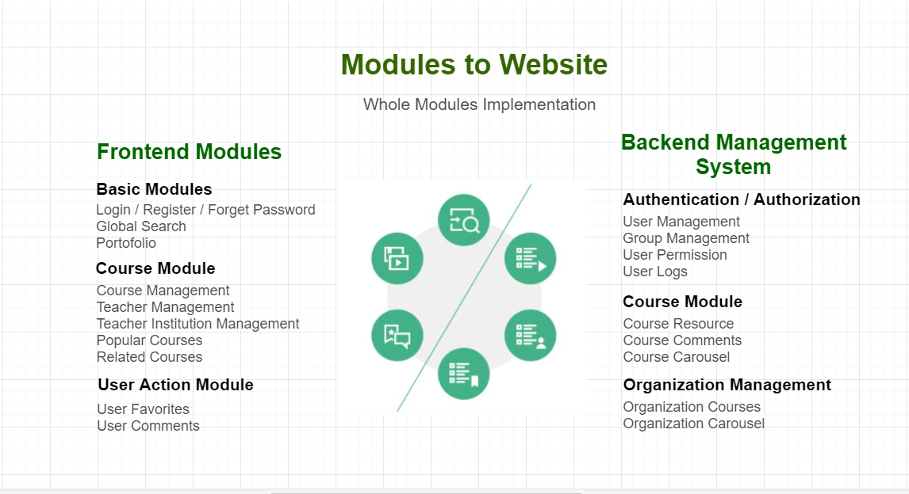

# Introduction

## Online Learning platform

Python: 3.6.5

Django: 2.1.2

## Spring Boot Project 

Spring Boot 2.0.X

Spring Cloud

## Search Engine

Numpy

# 0. Project Introduction

## Project Summary

### Modules to Website

### Zero to Deployment

### Modules Design

### Functional Summary

* 系统具有完整的用户登录注册以及找回密码功能，拥有完整个人中心。
* The system has a complete user login/registration and password recovery function, and has a complete personal portfolio.
* 个人中心: 修改头像，修改密码，修改邮箱，可以看到我的课程以及我的收藏。可以删除收藏，我的消息。
* Personal Portfolio: change avatar, change password, modify Email; can see My Courses and My Favorites; can delete My Favorites, My Messages.
* 导航栏: 公开课，授课讲师，授课机构，全局搜索。
* Navigation bar: Open class, lecturer, lecturer, global search.
* 点击`公开课`–&gt; 课程列表，排序-搜索。热门课程推荐，课程的分页。
* Click on Public Courses–&gt; Course List, Sort - Search. Popular Courses, pagination of courses.
* 点击`课程`–&gt; 课程详情页中对课程进行收藏，取消收藏。富文本展示课程内容。
* Click on Course –&gt; in Course Details page, can save/cancel courses. Rich text to display course content.
* 点击`开始学习`–&gt; 课程的章节信息，课程的评论信息。课程资源的下载链接。
* Click Start Learning –&gt; chapter information for the course, and reviews for the course and download link to the course resources.
* 点击`授课讲师`–&gt;授课讲师列表页，对讲师进行人气排序以及分页，右边有讲师排行榜。
* Click on the Lecture Instructor –&gt; Lecture Instructor List page, to sort the lecturer's popularity and pagination, and the instructor leaderboard on the right.
* 点击`讲师的详情页面`–&gt; 对讲师进行收藏和分享，以及讲师的全部课程。
* Click on the instructor's details page –&gt; save and share the lecturer, and the instructor's all courses.
* 导航栏: 授课机构有分页，排序筛选功能。
* Navigation bar: The teaching institution has paging, sorting and filtering functions.
* 机构列表页右侧有快速提交我要学习的表单。
* On the right side of the organization list page, there is a quick submission of the form that I want to learn.
* 点击`机构`–&gt; 左侧：机构首页,机构课程，机构介绍，机构讲师。
* Click on Organization–&gt; left: agency home page, institutional course, agency introduction, agency lecturer.
* 后台管理系统可以`切换主题`。左侧每一个功能都有列表显示, 增删改查，筛选功能。
* The back-end management system can switch themes. Left navigation bar has list display, add, delete, and check functions.
* 课程列表页可以对不同字段进行排序。选择多条记录进行删除操作。
* The course list page can sort based on different fields. Can select multiple records to delete.
* 课程列表页：过滤器-&gt;选择字段范围等,搜索,导出csv，xml，json。
* Course list page: Filter -&gt; Select field range to search and export as .csv, .xml, .json.
* 课程新增页面上传图片，富文本的编辑。时间选择，添加章节，添加课程资源。
* The Add New Course page can upload images, rich text editing. Time selection, add chapters, add course resources.
* 日志记录：记录后台人员的操作。
* Logging: Recording the operations of the back office personnel.
